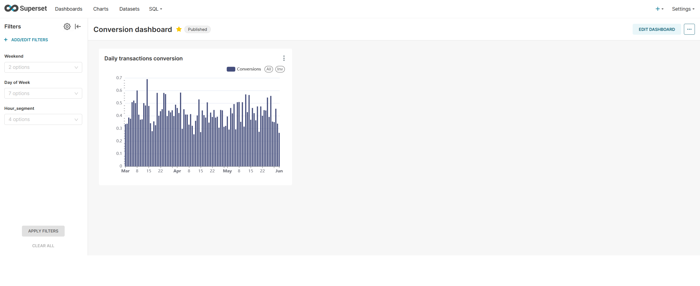

# 💳 Katapay Project

This project demonstrates an end-to-end analytics pipeline using [dbt](https://docs.getdbt.com/) and PostgreSQL, with synthetic transaction data for dashboarding in Apache Superset.

## 📦 Features

- Parses raw transaction events from a local JSON file (`ingest.py`) and inserts them into a staging table (`raw_transactions`)
- Due to the limited volume of raw data, additional synthetic transaction data is generated using `dbt` models
- Enriches timestamps using a `dim_time` table with holiday and hour metadata
- Uses `dbt seed` to load a holiday calendar
- Prepares models and tests with `dbt`
- Generates documentation with `dbt docs`
- Ready to connect with [Superset](https://superset.apache.org/) for visualization

## 🏗️ Setup Instructions

### 1. Start Containers

```bash
docker-compose up -d
```

### 2. Install dbt dependencies

```bash
dbt deps
```

### 3. Load seed data (e.g. holiday list)

```bash
dbt seed
```

### 4. Ingest Raw Data

```bash
python ingest.py
```

This parses a local JSON file and inserts raw events into the `raw_transactions` table.

### 5. Build Models and Run Tests

```bash
dbt run
dbt test
```

This runs transformations, builds synthetic data, joins with the time dimension, and verifies model quality.

### 6. Generate Documentation

```bash
dbt docs generate
```

To view the documentation in your browser:

```bash
dbt docs serve
```

## 📊 Superset
